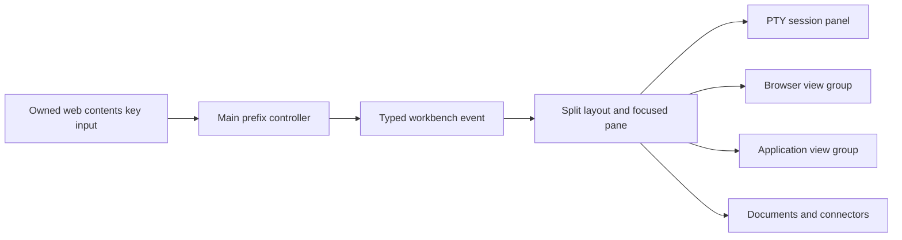
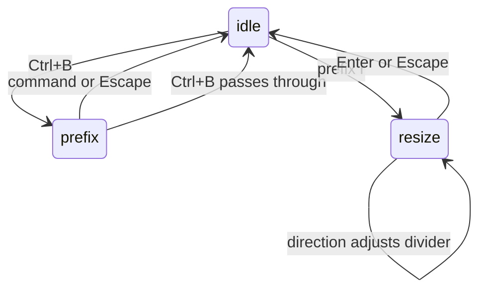

# Simultaneous terminal, browser, and app workbench

## Goal Capsule

Show live terminal sessions, a web browser, and an application view together in
TommyBrown, with Herdr's keys for equivalent workbench operations. The current user
request governs this extension of the existing desktop contract. Execute sequentially;
finish with observed Electron behavior and a runnable Windows build. Merge is a
separate user-controlled action.

## Product Contract

### Summary and problem

The current support area switches between documents, browser, and connectors.
Opening one hides the others. The new workbench keeps the terminal, browser, and
app visible together and lets the user adjust the working area without losing work.

### Requirements

- R1: Start with a terminal on the left, browser above an app view on the right.
  Each region owns its tabs, scroll, loading, empty, and error states.
- R2: Resize dividers, split terminal regions, move focus directionally, zoom and
  restore a pane, and close a pane without disturbing unrelated sessions.
- R3: Use Herdr's Ctrl+B prefix and documented bindings for equivalent operations:
  c new tab; v / - split right/down; h/j/k/l focus; H/J/K/L swap; z zoom;
  r resize mode; x close pane; X close tab; n/p and 1..9 select tabs;
  b sidebar; w workspace navigation; g session navigation; ? help.
  Escape cancels modes. A repeated Ctrl+B passes one literal Ctrl+B to the client.
- R4: Recognize these keys inside terminals and embedded web content. Ordinary
  typing, shell Ctrl+C, browser input, and editor shortcuts retain their behavior.
- R5: Retain layout and app/browser tabs on restart. Pane focus and zoom never
  stop PTYs or discard document drafts. Terminal process restart semantics stay
  consistent with the existing application.
- R6: Preserve remote-page isolation, existing documents/connectors, model settings,
  terminal URL opening, and a usable minimum desktop size of 960 by 640.

### Assumption

The application pane initially covers localhost web applications and connected web
services, matching the project's existing app-view contract. The user was asked
whether Windows desktop-window viewing is also intended; a later answer changes
that surface's scope. The common layout and keyboard work is independent of it.
Herdr-only server detach, worktrees, and its terminal copy-mode editor are not new
TommyBrown features in this layout change; their keys must not claim to implement them.

## Planning Contract

### Key technical decisions

- Extend the existing Electron WebContentsView service with explicit view groups.
  Selection hides siblings in the same group only, so browser and app views coexist.
- Keep a bounded binary split tree in renderer state. Stable leaf identifiers own
  mounted content; splitting, resizing, swapping, and zooming preserve that identity.
  Persist proportions and pane kinds, never live PTY identifiers as restart promises.
- Handle the prefix in main's before-input-event for the trusted renderer and owned
  remote views. Forward a narrow typed command event to the renderer. Disable it
  outside the workbench and reset prefix state on window blur and mode exit.
- Clamp view bounds to the window; hide native views during overlays, invisible pages,
  and splitter dragging. Native child views otherwise sit above renderer overlays.
- Reuse React, xterm, Radix icons, Zod, and existing CSS tokens. Add no UI dependency.

### High-Level Technical Design

## Implementation Units

### U1. Independent browser and application views

**Requirements:** R1, R5, R6. **Dependencies:** none.
**Files:** `src/shared/browser.ts`, `src/main/browser/service.ts`,
`src/main/index.ts`, `src/preload/index.ts`, renderer browser hook/pane,
`tests/desktop/workbench.e2e.ts`.
**Approach:** add a validated group identifier with a backwards-compatible default;
return group-local snapshots and keep popup navigation in its originating group.
**Tests:** show two different live pages together; selecting, navigating, closing,
or opening a popup in one group preserves the other; untrusted pages lack IPC.
**Verification:** real WebContentsView bounds and screenshot show both pages.

### U2. Persistent split workbench

**Requirements:** R1, R2, R5, R6. **Dependencies:** U1.
**Files:** renderer workspace layout/panes/view state and CSS, `DESIGN.md`,
`tests/workspace/layout.test.ts`, `tests/desktop/workbench.e2e.ts`.
**Approach:** default three-pane tree, stable mounted leaves, bounded splitter
controls with pointer and keyboard operation, explicit focused-pane header, zoom,
terminal splits, and retained document/connector access.
**Tests:** split/remove/swap, divider limits, invalid persisted state fallback,
zoom restoration, tab independence, unchanged PTY output, and minimum window size.
**Verification:** exercise actual shell input during simultaneous browser/app rendering.

### U3. Herdr keyboard routing

**Requirements:** R2, R3, R4. **Dependencies:** U2.
**Files:** `src/shared/workbench.ts`, main shortcut controller, preload bridge,
renderer command handling/help, `tests/workspace/shortcuts.test.ts`,
`tests/desktop/workbench.e2e.ts`.
**Approach:** one command table shared by dispatch and searchable help; identify
the originating view group before acting. Forward literal prefix and ordinary input.
**Tests:** prefix consumption, repeat/keyup handling, cancellation, shifted bindings,
focus from remote page to terminal, resize mode, and no shortcuts on model settings.
**Verification:** real keyboard events drive commands from both renderer and web pages.

### U4. Desktop verification and delivery

**Requirements:** R1-R6. **Dependencies:** U1-U3.
**Files:** existing desktop regressions, `README.md`, `docs/verification/`,
`docs/solutions/`.
**Approach:** run the existing product paths plus the new simultaneous flow; inspect
native composite captures, review correctness/security/accessibility, and package.
**Tests:** source and packaged desktop, restart, settings navigation, terminal cleanup,
long URLs/titles, failure recovery, keyboard-only flow, and reduced motion.
**Verification:** all required checks pass and evidence states exact supported behavior.

## Verification Contract

Run `bun run check`, `bun run lint`, `bun run test`, `bun run build`, and
`bun run test:desktop`. Use unique isolated app data and loopback fixtures. Capture
native composites because renderer screenshots omit native child views. Inspect
1320 by 880 and 960 by 640 Windows surfaces. Keep private captures in ignored
`test-results/`; publish only sanitized written evidence. Review the actual diff.

## Definition of Done

The three surfaces visibly coexist, supported Herdr keys work from all owned content,
split/focus/zoom/resize preserve active sessions, restart restores views, desktop
regressions pass, and the Windows build contains this implementation. Remove abandoned
experiments. Record any native-app scope clarification before claiming that surface done.

## Sources

- [Herdr keyboard contract](https://github.com/herdrdev/herdr/blob/e35f3937b0efe40ec0dab675709c68e1d8e8c9e6/docs/versions/0.9.3/website/src/content/docs/keyboard.mdx)
- [Electron input events](https://www.electronjs.org/docs/latest/api/web-contents#event-before-input-event)
- [StyleGallery panel layout](https://github.com/changeroa/StyleGallery/blob/main/patterns/viewport-shell/panel-layout.md)

## Planning review

Reviewed sequentially for coherence, feasibility, design, and security. The critical
risks are native views obscuring overlays, selection hiding another group, remounting
terminal content during tree edits, and consuming normal client keys. U1-U3 tests
explicitly cover those seams. Application surface terminology is an explicit assumption.
